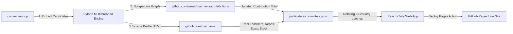

# GitTop

<p align="center">
  
  
  
  
  
  
  
</p>

> **[HIGH-PRECISION] [GLOBAL-LEADERBOARD] [OPEN-SOURCE]**  
> Top 30 most active open-source developers worldwide and across 73+ countries with 100% real live profile metrics and updated contribution graph stats.

---

## 🚀 Release v1.0 Overview

GitTop **v1.0** delivers a high-precision, real-time leaderboard platform for tracking open-source contributions globally.

### Key Highlights of Release v1.0
- **⚡ Real-Time Multithreaded Engine**: Scrapes exact live contribution graph totals and profile stats directly from GitHub profiles without API rate-limit bottlenecks.
- **🌍 73+ Country & Regional Filters**: Quick access pill bar + search-enabled drawer supporting ISO codes (`[CO]`, `[GLOBAL]`, `[US]`, etc.).
- **📊 Responsive Views & Heatmaps**: Interactive Grid and Table layout options with 52-week activity heatmap preview and direct profile modals.
- **🤖 Automated 12-Hour Sync**: GitHub Actions scheduled background sync updating 20-country rotating batches seamlessly.
- **✨ Enhanced UX**: Click-outside auto-close dropdowns, smooth country switching, and high-contrast accessible layout tags.

---

## 🛠️ Technologies & Stack

### Frontend & UI
| Technology | Description | Badge |
| :--- | :--- | :--- |
| **React 18** | UI component library powering dynamic state and modals | `` |
| **Vite 5** | Next-generation fast frontend build tool | `` |
| **Tailwind CSS** | Utility-first CSS framework for modern styling | `` |
| **Lucide Icons** | Clean, modern UI icon system | `` |

### Data Pipeline & Backend Engine
| Technology | Description | Badge |
| :--- | :--- | :--- |
| **Python 3.10+** | Multithreaded scraping engine (`ThreadPoolExecutor`) | `` |
| **BeautifulSoup4 / Requests** | Live HTML parsing of GitHub profiles & contribution graphs | `` |

### Automation & CI/CD
| Technology | Description | Badge |
| :--- | :--- | :--- |
| **GitHub Actions** | Automated 12-hour scheduled background scraper workflows | `` |
| **GitHub Pages** | Automated deployment workflow via GH-Pages action | `` |

---

## Key Features

- **[REAL-DATA] Live Profile & Contribution Sync**: Contrasts candidate listings from `committers.top` with exact live contribution graph totals scraped directly from `https://github.com/users/{username}/contributions` and live profile HTML (`github.com/{username}`).
- **[METRICS] Verified Metrics**: Zero artificial multipliers or mock estimates. Directly extracts real follower counts, public repository numbers, stargazers received, bios, avatars, and primary programming languages.
- **[GLOBAL-COVERAGE] 73 Countries & Regional Tabs**: Filter developers by country or region (*Worldwide/Global*, *LATAM*, *North America*, *Europe*, *Asia & Oceania*, *Africa*).
- **[AUTOMATED] Rotating 12-Hour Sync**: GitHub Actions updates an interleaved batch of up to 20 countries every 12 hours, completing all countries in four runs without exhausting API quotas.
- **[PROFILES] Interactive Profile Modal**: Inspect 52-week contribution heatmaps, primary stack languages, company, location, and verified GitHub profile links.
- **[LAYOUT] Strict Reading Order**: Clean cards and table views sorted strictly left-to-right (`#1`, `#2`, `#3`...).
- **[PAGES] GitHub Pages Deploy**: Fully automated CI/CD deployment to GitHub Pages via GitHub Actions (`.github/workflows/deploy_gh_pages.yml`).

---

## Quick Country Selection Pills

GitTop supports **73 countries** with ISO code pills:

- `[GLOBAL] Worldwide`
- `[CO] Colombia`
- `[US] United States`
- `[ES] Spain`
- `[DE] Germany`
- `[BR] Brazil`
- `[GB] United Kingdom`
- `[JP] Japan`
- `[MX] Mexico`
- `[AR] Argentina`
- *And 63+ more countries...*

---

## Architecture & Data Pipeline



---

## GitHub Pages Deployment Guide

Hosting **GitTop** on **GitHub Pages** is 100% free and automated.

### Step-by-Step Instructions

1. **Push your code to GitHub**:
   ```bash
   git add .
   git commit -m "feat: setup GitTop GitHub Pages deployment"
   git push origin main
   ```

2. **Enable GitHub Actions Pages Deployment**:
   - Navigate to your repository on GitHub: `https://github.com/{your-username}/{your-repo}`
   - Click on **Settings** -> **Pages** (in the left sidebar).
   - Under **Build and deployment** -> **Source**, select **GitHub Actions**.

3. **Automatic Deployment**:
   - The workflow `.github/workflows/deploy_gh_pages.yml` will automatically build and publish your site to:
     `https://{your-username}.github.io/{your-repo}/`

---

## Local Development & Setup

### Prerequisites
- **Node.js**: `v18.0` or higher
- **Python**: `v3.10` or higher

### 1. Clone & Install Dependencies
```bash
git clone https://github.com/DevCop95/gitrank.git
cd gitrank
npm install
```

### 2. Run Local Development Server
```bash
npm run dev
```
Open `http://localhost:3000` in your browser.

### 3. Manually Run Live Contribution & Profile Scraper Engine
```bash
python scripts/build_fast_multithreaded_real_stats.py
```
This updates the next rotating batch of countries in `public/data/committers.json`. Set `SCRAPE_MODE=full` only when a complete refresh is explicitly required.

---

## Repository Structure

```
gittop/
├── .github/
│   └── workflows/
│       ├── update_rankings.yml     # 5-Hour Rotating Batch Workflow
│       └── deploy_gh_pages.yml     # Automated GitHub Pages Deployment
├── public/
│   └── data/
│       └── committers.json          # Live Updated Dataset
├── scripts/
│   ├── build_fast_multithreaded_real_stats.py # Core Live Python Engine
│   └── test_contributions_endpoint.py
├── src/
│   ├── components/
│   │   ├── Navbar.jsx
│   │   ├── SyncStatusBadge.jsx
│   │   ├── CountrySelector.jsx
│   │   ├── DeveloperCard.jsx
│   │   ├── LeaderboardTable.jsx
│   │   └── DeveloperModal.jsx
│   ├── data/
│   │   └── countriesList.js         # Metadata for 73 Countries
│   ├── utils/
│   │   └── cleanText.js             # HTML Entity Decoder
│   ├── App.jsx
│   └── main.jsx
├── index.html
├── vite.config.js
└── package.json
```

---

## License

Distributed under the **MIT License**. See `LICENSE` for more information.

